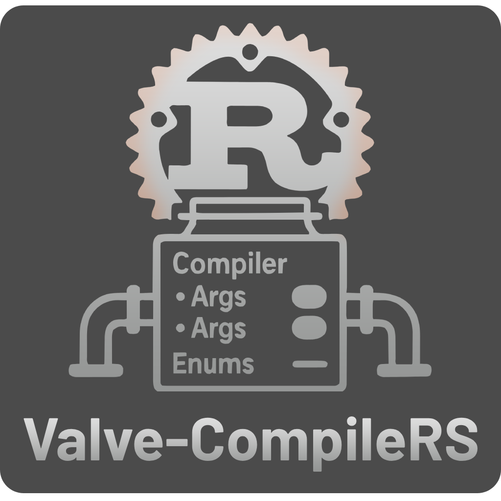

<div align="center">


[](https://crates.io/crates/valve_compilers)
[](https://docs.rs/valve_compilers)


## `Valve-compileRS` is a type-safe, ergonomic, and extensible Rust library for building command-line arguments for Valve's Source Engine compiler tools like `vbsp`, `vvis`, and `vrad`.

</div>

### Overview

Interfacing with the Source Engine's command-line tools can be cumbersome and error-prone. This library solves that problem by providing a native Rust API that is:

*   **Configuration-Driven:** All compiler arguments are defined in simple `.toml` files. Adding a new tool or argument requires no code changes, just a new config file.
*   **Type-Safe:** The build script automatically generates enums and structs, so you can't pass a string where an integer is expected. This eliminates a whole class of runtime errors.
*   **Ergonomic:** The API is designed to be intuitive and easy to use, with a fluent builder-like pattern for constructing commands.
*   **Extensible:** Easily add support for custom or community-made compiler tools by dropping a new `.toml` file into the `compiler_configs` directory.

### Features

*   **Automatic Code Generation:** A powerful `build.rs` script parses `.toml` configs and generates all necessary Rust modules, enums, and argument types.
*   **Contextual Placeholder Replacement:** Uses a `CompilerContext` to automatically substitute placeholders like `$gameDir`, `$mapName`, and `$bspPath` in your arguments and working directories.
*   **Game Compatibility Checks:** Arguments can be constrained to specific game App IDs, preventing the use of incompatible flags (e.g., CS:GO-specific arguments in Team Fortress 2).
*   **Without unnecessary dependencies:** that says it all :P

### Why?

This crate provides the ideal backend for any application that automates the Source Engine compile process. It's perfectly suited for building custom CLI/GUI wrappers, CI/CD automation scripts, or even a new map editor—like a "Hammer 2.0" rewritten in Rust. ;)

### Installation

Add `valve_compilers` to your `Cargo.toml`:

```toml
[dependencies]
valve_compilers = "1"
```

### Quick Start

Here's a simple example of how to build a command for `vbsp`:

```rust
use valve_compilers::{Compiler, CompilerContext};
use valve_compilers::vbsp::{Vbsp, VbspArg}; // The Vbsp and VbspArg types are auto-generated!
use std::path::PathBuf;

fn main() {
    // 1. Create a default compiler instance.
    // This will be pre-populated with default arguments from vbsp.toml.
    let mut vbsp = Vbsp::default();

    // 2. Add or override arguments in a type-safe way.
    vbsp.add_arg(VbspArg::Verbose);
    vbsp.add_arg(VbspArg::NoWater);
    vbsp.add_arg(VbspArg::MicroVolumeTest(0.5)); // Pass floats, ints, or paths directly.

    // 3. Define the context for placeholder substitution.
    let context = CompilerContext::new(
        Some(PathBuf::from(r"C:\Steam\steamapps\common\Half-Life 2\bin")),
        Some(PathBuf::from(r"C:\Steam\steamapps\common\Half-Life 2\hl2")),
        Some(PathBuf::from(r"C:\Users\Gordon\maps\d1_trainstation_01.vmf")),
        None, // Output directory (defaults to map's directory if None)
    );

    // The executable path is determined from the context's bin_dir.
    // You can override it with an optional second argument.
    let command_info = vbsp.build_command(&context, None);

    // 4. Execute the command!
    println!("Compiler: {}", command_info.name);
    println!("Path: {}", command_info.compiler_path.display());
    println!("Working Directory: {}", command_info.working_dir.display());
    println!("Arguments: {}", command_info.args);

    // You can now pass these details to std::process::Command.
}
```

### How It Works

The magic is in the `build.rs` script. On compilation, it:
1.  Reads every `.toml` file in the `compiler_configs/` directory.
2.  For each file, it generates a corresponding Rust module (e.g., `vbsp.rs`).
3.  Each module contains a struct (e.g., `Vbsp`) that implements the `Compiler` trait and an enum (e.g., `VbspArg`) that implements the `CompilerArg` trait.
4.  This generated code is then included into the crate, providing a fully type-safe API for the compilers defined in your configs.

## Contributing

Contributions are welcome! Please feel free to open issues or submit pull requests.

## License

`Valve-compileRS` is distributed under the terms of either the [MIT license](LICENSE).
